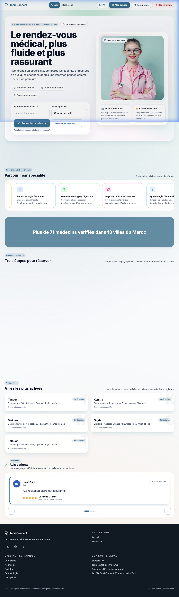
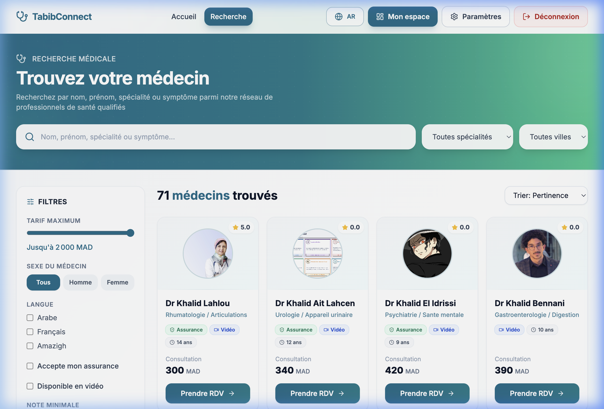
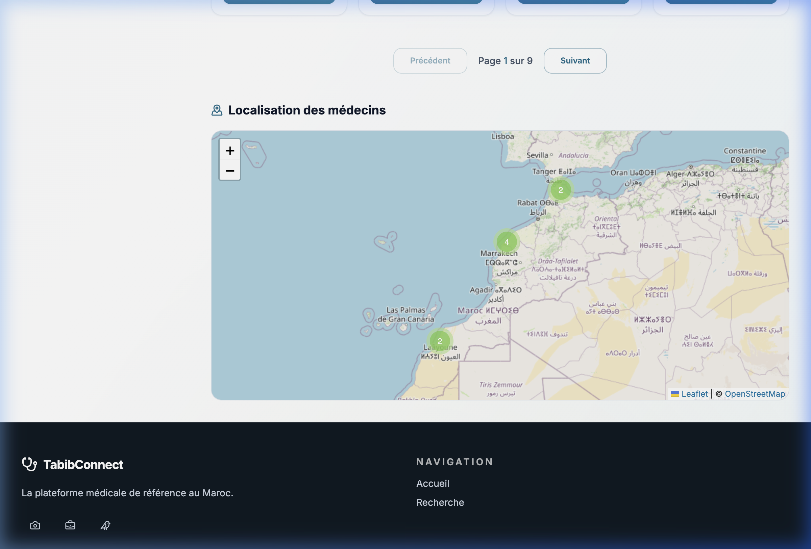
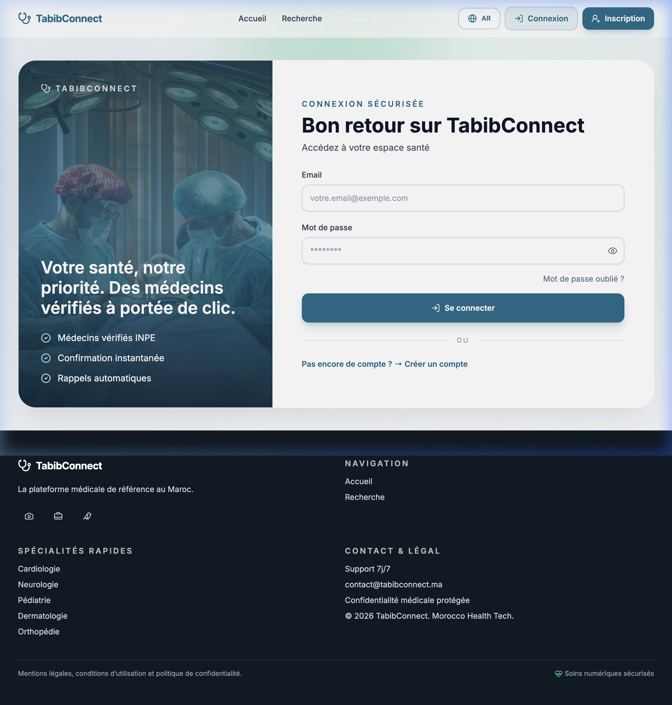
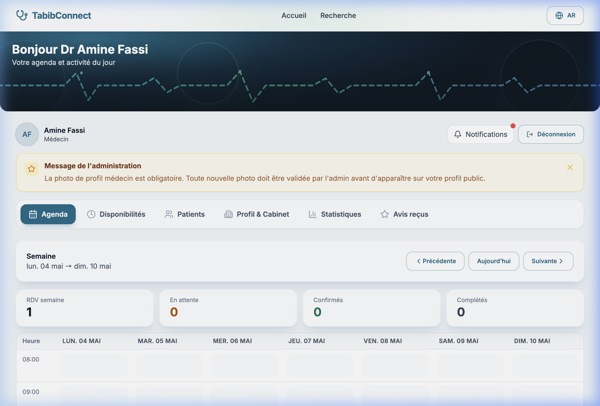
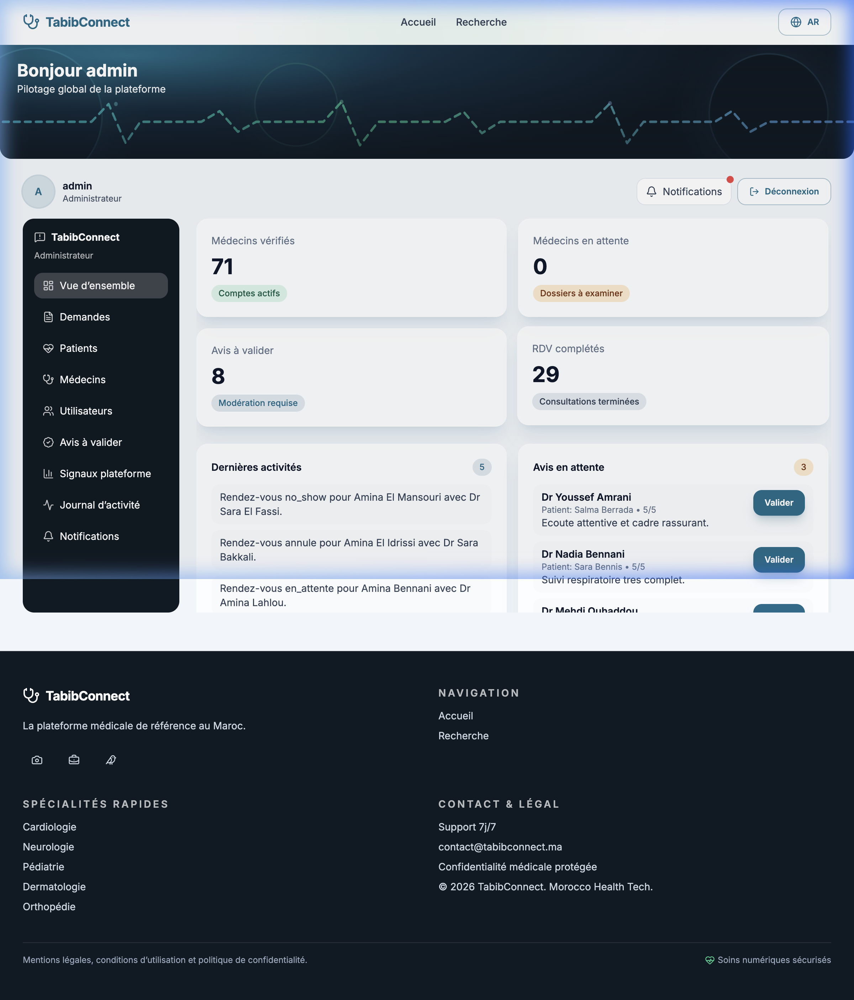

# TabibConnect — Master Documentation (Source de Vérité)

> **Plateforme web de prise de rendez-vous médicaux** (Patient, Médecin, Admin) — Maroc  
> **Dernière mise à jour :** 5 mai 2026 (Audit & Hardening terminés)  
> **Objectif :** Ce document centralise TOUTES les informations nécessaires pour une IA ou un développeur.

---

## 📷 Visuels de la Plateforme (UI/UX)

### 1. Page d'Accueil & Navigation

*Une interface moderne et épurée utilisant un design "Glassmorphism". La navigation est intuitive avec un accès rapide à la recherche et aux espaces dédiés.*

### 2. Recherche & Pagination intelligente

*Le moteur de recherche affiche désormais une **pagination de 8 docteurs maximum par page**. Le nombre total de médecins trouvés est dynamiquement mis à jour pour garantir une transparence totale.*

### 3. Carte interactive — Localisation des médecins

*La carte interactive affiche les cabinets des médecins sur une carte OpenStreetMap avec des **marqueurs clusterisés**. Un clic sur un cluster zoome pour révéler les cabinets individuels avec les informations du praticien.*

### 4. Connexion Sécurisée

*Interface de connexion optimisée avec gestion précise des erreurs (ex: "Identifiants incorrects" vs "Erreurs techniques").*

#### 🔑 Comptes de Test
| Rôle | Email | Mot de passe |
| :--- | :--- | :--- |
| **Admin** | `admin@tabibconnect.ma` | `TabibConnect@2026` |
| **Docteur** | `dr.amine.fassi@tabibconnect.ma` | `TabibConnect@2026` |
| **Patient** | `youssef.benali@tabibconnect.ma` | `TabibConnect@2026` |

### 5. Dashboard Médecin (Vue Agenda)

*Espace de travail complet pour le praticien. Les icônes et menus sont rendus de manière fluide, et les alertes administratives sont clairement identifiées.*

### 6. Dashboard Administration

*Tour de contrôle pour la validation des nouveaux inscrits et la surveillance de l'activité globale de la plateforme.*

---

## 🏗️ Architecture Technique

### Stack Technologique
| Couche | Technologie |
| :--- | :--- |
| **Frontend** | React 18, Vite, Tailwind CSS, React Query, React Router v6 |
| **Backend** | Node.js, Express.js |
| **Base de données** | PostgreSQL, Prisma ORM |
| **Temps Réel** | Socket.IO (Notifications push & refresh dashboard) |
| **Sécurité** | JWT (Access/Refresh), Global double CSRF, Helmet, Rate Limiting |
| **Tests** | Jest, Supertest, Vitest, Playwright |
| **Infrastructure** | Docker, Docker Compose, Nginx Reverse Proxy |

### Structure des Dossiers
- `backend/` : Logique serveur, Prisma schema, services métier, API.
- `frontend/` : Application React, hooks personnalisés, composants UI.
- `docs/screenshots/` : Captures d'écran de l'interface.
- `uploads/` : Stockage des documents (CIN, photos) avec isolation sécurisée.

---

## 📊 Base de Données — Schéma Prisma

### Modèles Principaux (15 modèles)
- **User** : Compte central (email, phone, role, refresh token hash).
- **Patient** : Profil médical, CIN, antécédents, historique RDV.
- **Doctor** : INPE, spécialité, tarifs, bio, cabinets, documents.
- **Cabinet** : Localisation physique (ville, quartier, GPS).
- **Disponibilite** : Créneaux hebdomadaires gérés par le médecin.
- **RendezVous** : Cœur de l'app (statut: EN_ATTENTE, CONFIRME, ANNULE, COMPLETE, NO_SHOW).
- **AuditLog** : [NOUVEAU] Trace toutes les actions administratives sensibles.

---

## 🌐 Routes API & Frontend

### Routes API Critiques (`/api/...`)
- `/auth` : Inscription, Connexion, Logout, Refresh, CSRF-Token.
- `/doctors` : Recherche (ILike/Full-text), Profil, Agenda, Disponibilités.
- `/appointments` : Création (avec transaction DB), Confirmation, Annulation, Avis.
- `/admin` : Gestion utilisateurs, Logs, Métriques, Validation documents.
- `/dashboard` : Endpoints agrégés pour Patient, Docteur et Admin.

### Navigation Frontend
- `/search` : Recherche globale.
- `/dashboard/patient` : Suivi et historique.
- `/dashboard/doctor` : Gestion de l'agenda et des patients.
- `/dashboard/admin` : Pilotage et modération.

---

## 🔐 Sécurité & Hardening (Audit 05/05/2026)

L'audit technique du 5 mai a permis de corriger les vulnérabilités suivantes :
1. **Global CSRF** : Protection appliquée à toutes les routes de mutation (POST/PUT/DELETE).
2. **In-Memory CSRF** : Le jeton n'est plus dans `localStorage` mais en mémoire (protection XSS).
3. **Path Traversal** : Serveur de fichiers sécurisé (interdiction de sortir du dossier `uploads`).
4. **JWT Security** : Blocage du serveur en production si les secrets par défaut sont détectés.
5. **Rate Limiting** : Protection contre le brute-force et le spam de réservations.
6. **Audit Logging** : Traçabilité complète des actions des administrateurs.
7. **Error Boundaries** : Gestion propre des crashs frontend pour éviter l'écran blanc.

---

## 🤖 Guide IA — Patterns & Logique Métier

- **Services Layer** : Toute la logique métier est dans `backend/src/services/`. Les contrôleurs ne font que passer les données.
- **Transactions** : La création de rendez-vous utilise des transactions Prisma pour garantir l'intégrité (RDV + Paiement + Notification).
- **File Serving** : Les fichiers (photos, documents) ne sont JAMAIS servis en statique. Ils passent par un contrôleur qui vérifie les permissions et normalize les chemins.
- **Real-time** : Socket.IO est utilisé pour mettre à jour les badges de notification en temps réel.

---

## ⚙️ Installation & Démarrage

### Backend
```bash
cd backend
cp .env.example .env # Configurer DATABASE_URL, JWT_SECRET, CSRF_SECRET
npm install
npx prisma generate
npx prisma db push
npm run dev # Port 4000
```

### Frontend
```bash
cd frontend
npm install
npm run dev # Port 5173
```

---

## 📋 Historique & Contribution
- **v1.0.2 (Mai 2026)** : Audit de sécurité complet, pagination de 8, hardening global.
- **v1.0.1 (Avril 2026)** : Documentation et captures d'écran.
- **v1.0.0 (Avril 2026)** : Lancement initial (MVP).

**Règles de contribution :**
- Secrets jamais commités.
- Tests obligatoires pour tout changement métier.
- Utiliser `resolveImageUrl` pour tout affichage d'image venant du backend.
