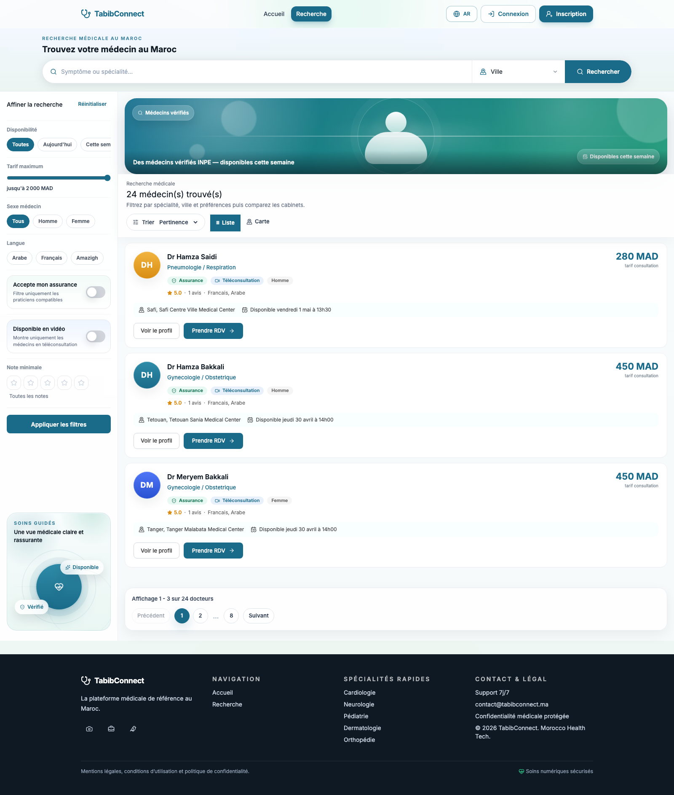
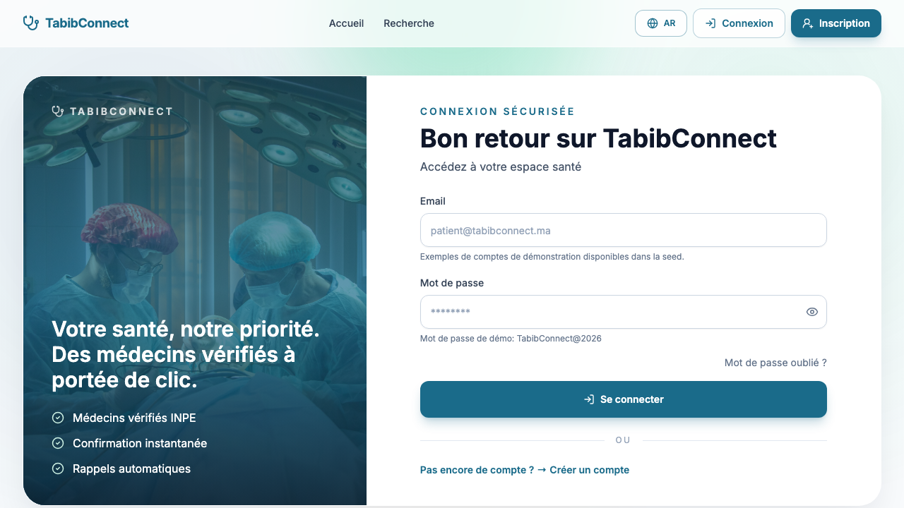
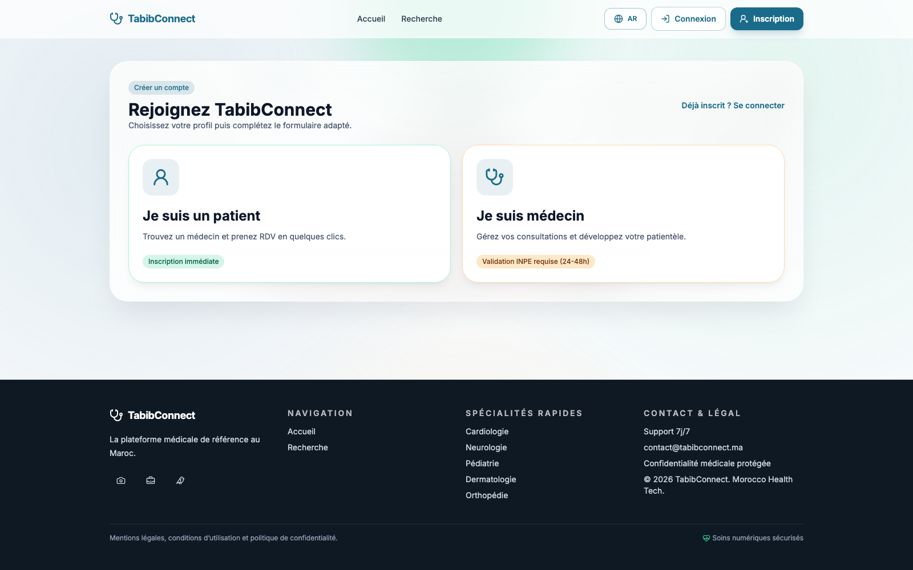

# TabibConnect

Plateforme web de prise de rendez-vous medicaux (patient, medecin, admin), avec recherche de medecins, gestion de rendez-vous, tableaux de bord metier et validation admin.

## Documentation conservee

Les fichiers Markdown conserves dans le repo sont:
- `README.md` (ce document)
- `CONTRIBUTING.md` (regles de contribution)
- `CHANGELOG.md` (historique des versions)

Les fichiers docs redondants ont ete supprimes pour garder une base claire.

## Fonctionnalites principales

- Authentification securisee (JWT, refresh token, CSRF, RBAC).
- Recherche medecins avec filtres (specialite, ville, disponibilite, assurance, etc.).
- Profil medecin avec disponibilites et informations cabinet.
- Dashboard patient (rendez-vous, suivi, notifications).
- Dashboard medecin (agenda, demandes, disponibilites).
- Dashboard admin (validation, moderation, operations).
- Dashboards refondus: architecture contextuelle par role (sidebar admin, tabs medecin, grille patient).
- Pagination serveur implementee sur les sections listes critiques (admin users/logs et vues associees).
- Nouvelles routes admin documentees: `/api/admin/users`, `/api/admin/doctors`, `/api/admin/reviews`, `/api/admin/logs`, `/api/admin/metrics`, `/api/admin/notifications`.
- Socket.IO temps reel: notifications (badge rouge) + rafraichissement dashboards.
- Dashboard patient: endpoints pagines `/api/dashboard/patient/history` et `/api/dashboard/patient/notifications`.

## Stack technique

- Frontend: React + Vite + Tailwind + React Query
- Backend: Node.js + Express
- Database: PostgreSQL + Prisma
- Carte: Leaflet
- Tests: Jest/Supertest, Vitest, Playwright

## Demarrage rapide

### 1) Backend

```bash
cd backend
cp .env.example .env
npm install
npx prisma generate
npx prisma db push
npm run dev
```

### 2) Frontend

```bash
cd frontend
npm install
npm run dev
```

### 3) URL locales

- Frontend: `http://localhost:5173`
- API: `http://localhost:4000/api`

## Variables d'environnement

- Ne jamais versionner de fichier `.env`.
- Utiliser uniquement:
  - `backend/.env.example`
  - `.env.production.example`
- Remplacer toutes les valeurs `change_me_*` avant deploiment.

## Captures d'ecran plateforme

Les captures ci-dessous sont integrees dans le repository:

#### Accueil


#### Recherche medecins



#### Connexion



#### Inscription



## Qualite et verification

Commandes utiles:

```bash
cd backend && npm test
cd frontend && npm run build
cd frontend && npm run lint
```

